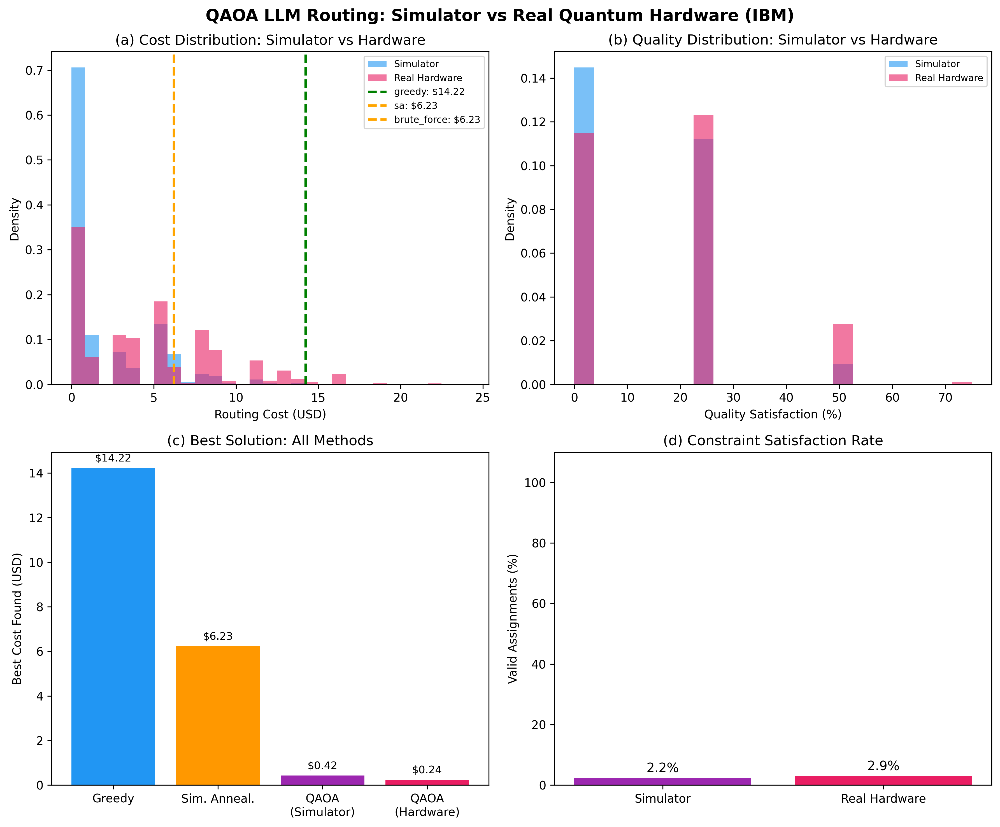
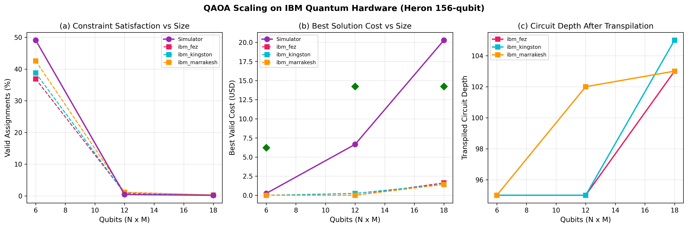
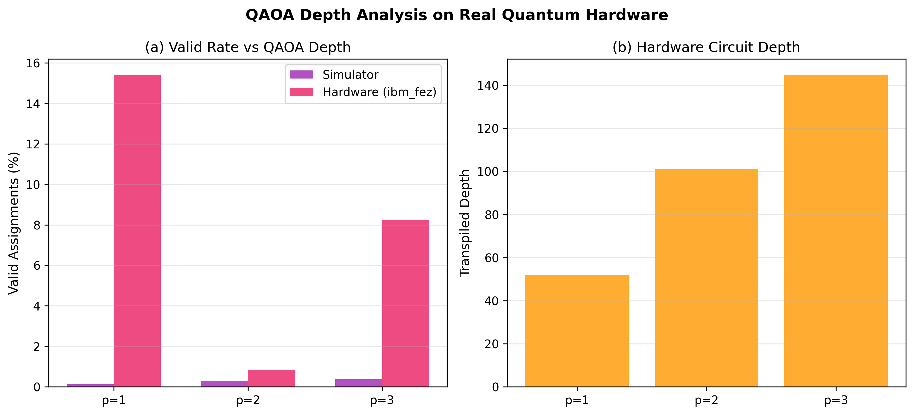
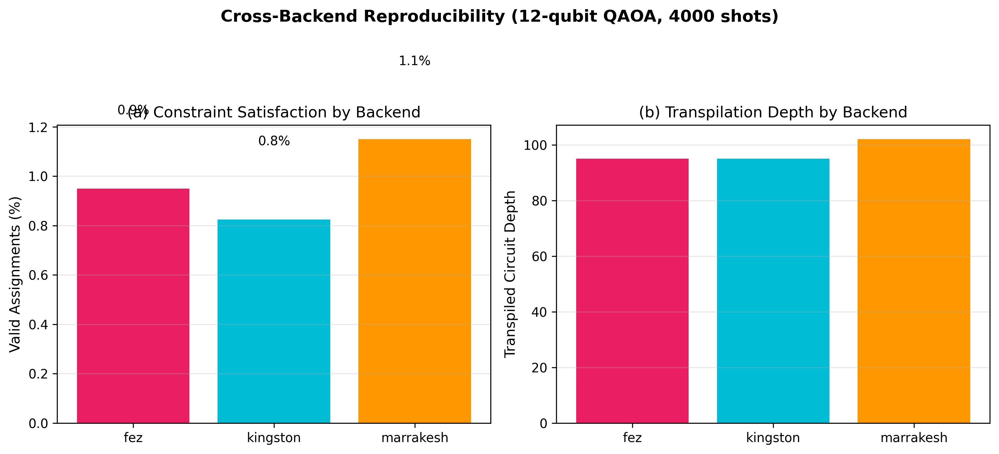
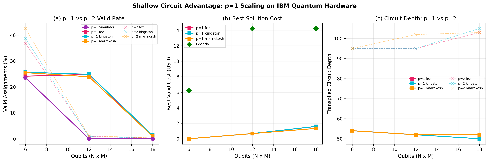
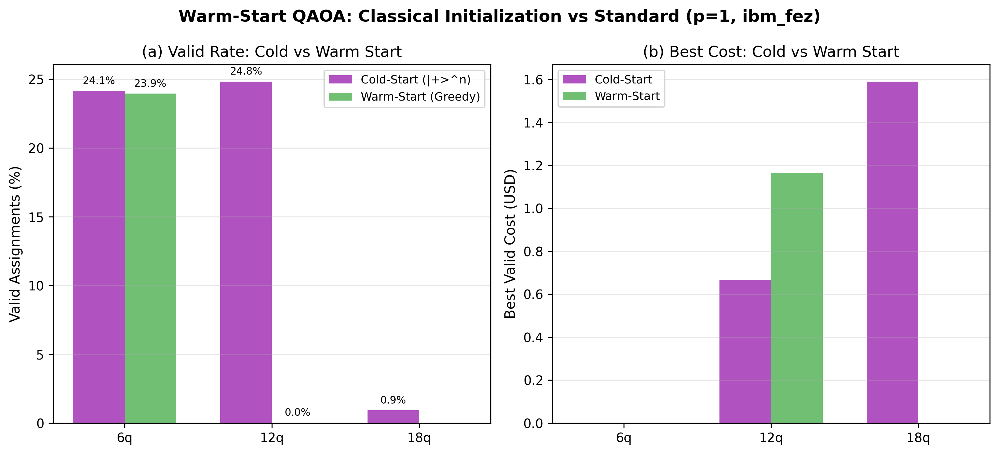
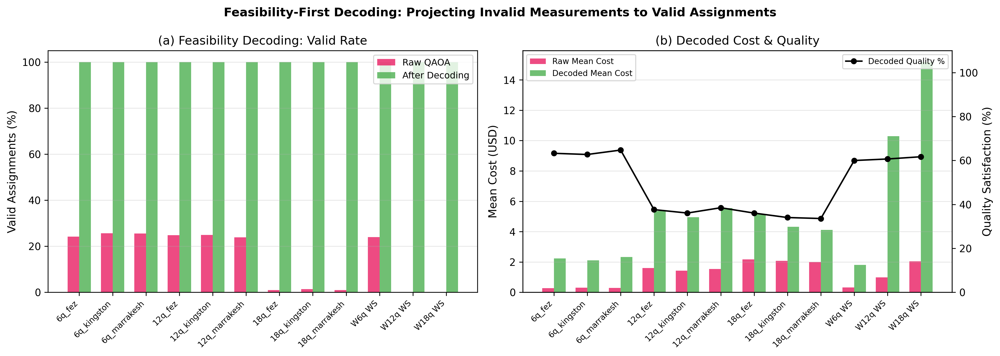

# Quantum-Enhanced LLM Cascade Routing

**First QUBO formulation of the LLM model selection problem, solved with QAOA and benchmarked on real IBM Quantum hardware.**

> A. Patole, "Quantum-Enhanced LLM Cascade Routing: A QAOA Approach to Cost-Optimal Model Selection in Multi-Agent Systems," *Preprints.org*, 2026. ID: 206903.

---

## Overview

Modern multi-agent AI systems route tasks across multiple LLM tiers (free local models to premium APIs) with cost differences of 100-1000x. This project formalizes the **LLM Cascade Routing Problem (LCRP)** as a **QUBO** and solves it using the **Quantum Approximate Optimization Algorithm (QAOA)**.

### Key Findings

| Finding | Detail |
|---------|--------|
| **Shallow circuits win on NISQ** | p=1 QAOA achieves 24-25% valid rate vs <1% for p=2 on IBM hardware (25x improvement) |
| **Cross-backend reproducibility** | p=1 results consistent within +/-0.5% across 3 IBM Heron processors |
| **Warm-start negative result** | Simple X+H initialization from classical solution hurts NISQ performance |
| **Feasibility decoding** | Post-processing recovers 100% valid assignments with 33-65% quality |
| **Penalty threshold** | Critical lambda_Q ~20-40 determines whether QAOA respects quality constraints |

### Hardware Used

- **IBM ibm_fez** — 156-qubit Heron r1
- **IBM ibm_kingston** — 156-qubit Heron r1
- **IBM ibm_marrakesh** — 156-qubit Heron r1
- **28 quantum jobs** executed across 2 campaigns, ~45 seconds total QPU time

---

## Repository Structure

```
quantum-llm-routing/
├── poc/                          # Proof-of-concept implementations
│   ├── llm_routing_qaoa.py       # Core QAOA solver + classical baselines
│   ├── benchmark_suite.py        # Extended experiments (penalty, depth, scaling, Pareto)
│   ├── optimize_params.py        # Pre-optimize QAOA parameters on simulator
│   ├── ibm_hardware_run.py       # Submit circuits to IBM Quantum hardware
│   ├── hardware_experiment_suite.py  # Full hardware experiment suite (3 backends)
│   └── validation_experiment_suite.py  # v2 validation: p=1 scaling, warm-start, decoding
├── paper/
│   ├── main.tex                  # IEEE-formatted LaTeX paper
│   ├── main.pdf                  # Compiled paper (8 pages)
│   ├── figures/                  # Publication figures (12 total)
│   └── RESEARCH_PLAN.md          # Research plan and methodology
├── results/
│   ├── hardware_full_results.json    # Campaign 1 hardware data (16 jobs)
│   ├── validation_results.json       # Campaign 2 hardware data (12 jobs)
│   ├── optimized_params.json         # Pre-optimized QAOA parameters
│   ├── benchmark_results.json        # Simulator benchmark data
│   └── *.png                         # All generated figures (16 total)
├── requirements.txt
└── README.md
```

---

## Quick Start

### Installation

```bash
python3 -m venv venv
source venv/bin/activate
pip install -r requirements.txt
```

### Run Simulator Experiments

```bash
cd poc

# Core PoC: QAOA vs Greedy vs SA vs Brute Force
python llm_routing_qaoa.py

# Full benchmark suite: penalty sensitivity, depth analysis, scaling, Pareto frontier
python benchmark_suite.py

# Pre-optimize QAOA parameters
python optimize_params.py
```

### Run on IBM Quantum Hardware

```bash
# 1. Save your IBM Quantum credentials (get API key from https://cloud.ibm.com/iam/apikeys)
python ibm_hardware_run.py --setup --token YOUR_IBM_API_KEY

# 2. List available backends
python ibm_hardware_run.py --list-backends

# 3. Dry run (build circuit, no hardware submission)
python ibm_hardware_run.py --dry-run

# 4. Run on real hardware
python ibm_hardware_run.py --shots 4000

# 5. Full experiment suite across all backends
python hardware_experiment_suite.py
```

---

## Problem Formulation

Given **N tasks** with complexity scores and **M LLM models** with cost/quality profiles, find the minimum-cost assignment satisfying quality constraints and budget limits.

### QUBO Encoding

```
H = H_cost + lambda_A * H_assign + lambda_Q * H_quality + lambda_B * H_budget + lambda_L * H_latency
```

- **H_cost**: Normalized routing cost (minimize)
- **H_assign**: One-hot constraint (each task gets exactly one model)
- **H_quality**: Quality floor penalty (model must meet task's minimum quality)
- **H_budget**: Total budget cap
- **H_latency**: Latency SLA enforcement

### Production Model Tiers

| Model | Cost/1K tokens | Quality | Latency |
|-------|---------------|---------|---------|
| gemma2:2b (local) | $0.000 | 0.30 | 50ms |
| Claude Haiku | $0.250 | 0.60 | 200ms |
| Claude Sonnet | $3.000 | 0.82 | 500ms |
| Claude Opus | $15.000 | 0.95 | 1500ms |
| o1 | $60.000 | 0.99 | 3000ms |

---

## Results

### Simulator vs Hardware (12 qubits, p=2)



### Scaling on IBM Quantum Hardware



### Shallow Circuit Advantage (p=1 vs p=2 vs p=3)



### Cross-Backend Reproducibility



### p=1 Scaling Validation (Campaign 2)



### Warm-Start vs Cold-Start



### Feasibility-First Decoding



---

## IBM Quantum Job IDs

All 28 hardware results are independently verifiable on the IBM Quantum dashboard:

### Campaign 1 (Experiments A-C)

| Experiment | Backend | Job ID |
|-----------|---------|--------|
| Scaling 6q p=2 | ibm_fez | d7a2rmpq1efs73d3evd0 |
| Scaling 6q p=2 | ibm_kingston | d7a2rp0eecps73d8sm00 |
| Scaling 6q p=2 | ibm_marrakesh | d7a2rqoeecps73d8sm40 |
| Scaling 12q p=2 | ibm_fez | d7a2s4hq1efs73d3f010 |
| Scaling 12q p=2 | ibm_kingston | d7a2s68eecps73d8smk0 |
| Scaling 12q p=2 | ibm_marrakesh | d7a2shpq1efs73d3f0mg |
| Scaling 18q p=2 | ibm_fez | d7a2skbc6das739jj0pg |
| Scaling 18q p=2 | ibm_kingston | d7a2sm9q1efs73d3f0v0 |
| Scaling 18q p=2 | ibm_marrakesh | d7a2soik86tc73a0vnt0 |
| Depth p=1 | ibm_fez | d7a2sqrc6das739jj12g |
| Depth p=2 | ibm_fez | d7a2sv3c6das739jj180 |
| Depth p=3 | ibm_fez | d7a2t13c6das739jj1ag |
| High-shot | ibm_fez | d7a2t32k86tc73a0voe0 |

### Campaign 2 (Experiments D-E)

| Experiment | Backend | Job ID |
|-----------|---------|--------|
| p=1 Scaling 6q | ibm_fez | d7ak50jc6das739kc7a0 |
| p=1 Scaling 6q | ibm_kingston | d7ak52oeecps73d9m3d0 |
| p=1 Scaling 6q | ibm_marrakesh | d7ak54pq1efs73d488l0 |
| p=1 Scaling 12q | ibm_fez | d7ak571q1efs73d488og |
| p=1 Scaling 12q | ibm_kingston | d7ak59ik86tc73a1p05g |
| p=1 Scaling 12q | ibm_marrakesh | d7ak5bjc6das739kc7rg |
| p=1 Scaling 18q | ibm_fez | d7ak5e2k86tc73a1p0fg |
| p=1 Scaling 18q | ibm_kingston | d7ak5g1q1efs73d48990 |
| p=1 Scaling 18q | ibm_marrakesh | d7ak5iak86tc73a1p0n0 |
| Warm-start 6q | ibm_fez | d7ak5khq1efs73d489gg |
| Warm-start 12q | ibm_fez | d7ak5mgeecps73d9m4g0 |
| Warm-start 18q | ibm_fez | d7ak5orc6das739kc8i0 |

Total QPU time: ~45 seconds across 28 jobs.

---

## Citation

```bibtex
@article{patole2026quantum,
  title={Quantum-Enhanced LLM Cascade Routing: A QAOA Approach to Cost-Optimal Model Selection in Multi-Agent Systems},
  author={Patole, Amit},
  journal={Preprints.org},
  year={2026},
  note={ID: 206903}
}
```

---

## License

MIT License. See [LICENSE](LICENSE) for details.
